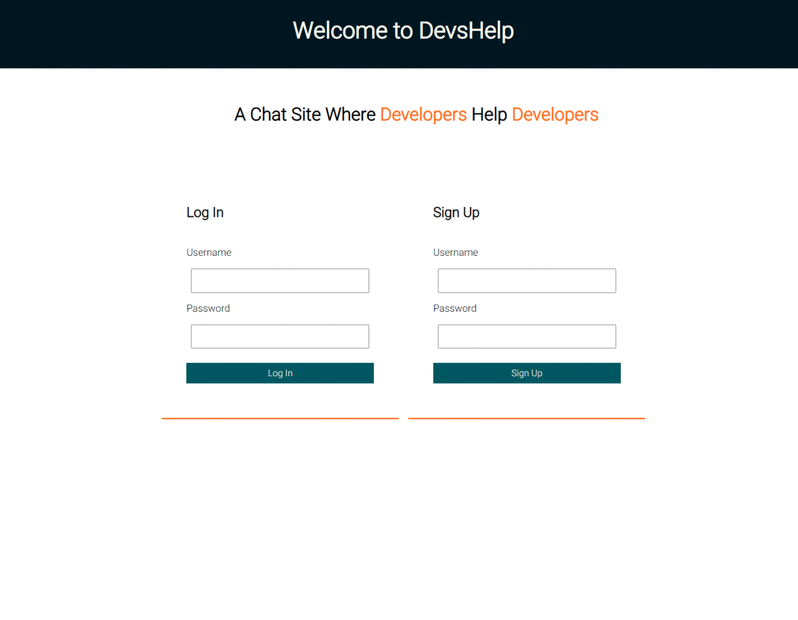
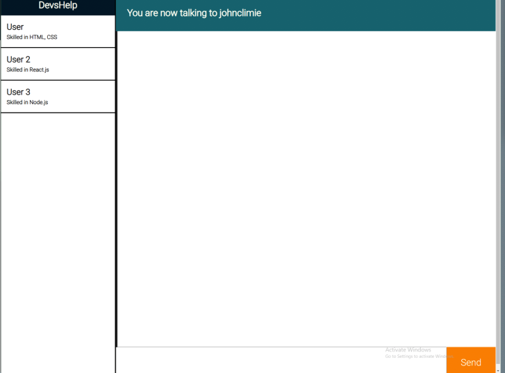

# DevsHelp

## Description

This application is a MERN chat-messaging tool that provides web developers a convenient way to join a community to ask other developers questions, advice and share ideas.  Users can create an account and login to the application with authentication. 

---

--- 

---

### Table of Contents

[Description](#description)
    
<!-- [How to Use](#how-to-use) -->

[Technology Used](#technology-used)

[Link to Deployed Application](#link-to-deployed-application)

[Authors](#authors)

[License](#license)

---

<!-- ### How to Use:

--- -->

#### Technology Used:

---

#### Link to Deployed App

<!-- [DevsHelp - Heroku](<heroku-app-name>.herokuapp.com) -->

---

#### Authors

- [John Climie](https://github.com/johnclimie)
  
- [Raquel Watson](https://github.com/nsoroma)
  
- [Heather Cooper](https://github.com/cheribc)
  
- [Samuel Riveros](https://github.com/SamRiv18)

---

#### License

[MIT](https://opensource.org/licenses/MIT)